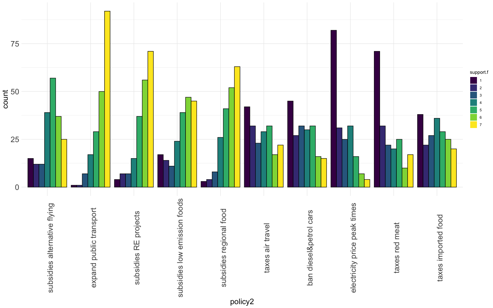
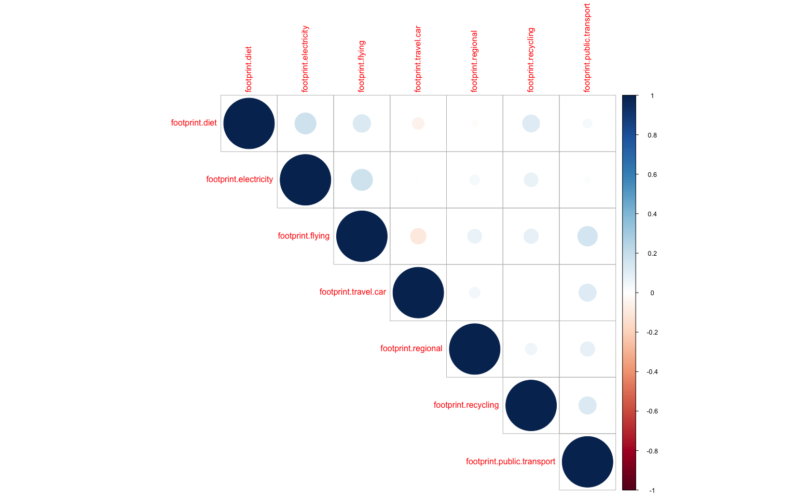
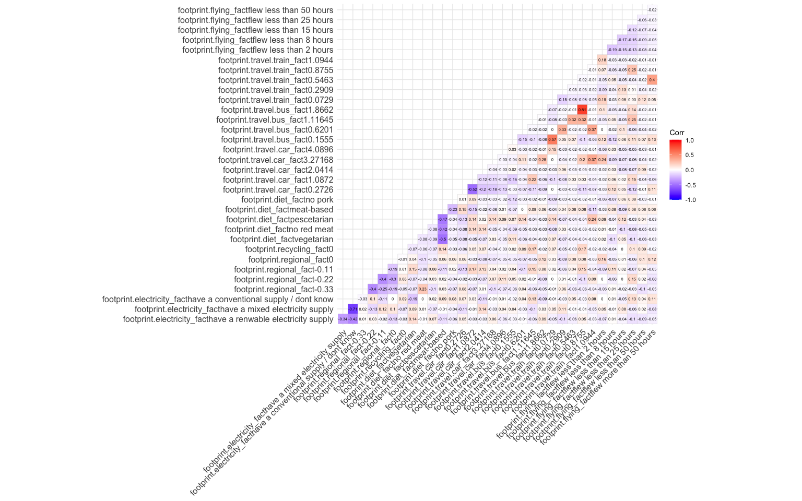

## Overview and descriptives


Sample:  
N=196, (excluded n=3 out of 199 because of inconsistent response (age and year of birth do not match +-1)).  
Age: Mean: 44, range: 19, 73.  
gender: female: 100 ; male: 99  
income: 

|income             |Frequency |
|:------------------|:---------|
|< 18.000£          |70        |
|> 45.001£          |36        |
|18.000£ to 23.000£ |20        |
|23.001£ to 30.500£ |38        |
|30.501£ to 45.000£ |36        |

  
  
### Climate change concern


```
##  left-leaning right-leaning 
##      5.046000      3.973333
```


### Policy support
Alpha= 0.87



### Reported Behaviors 
Correlation between reported behaviors




### Perceived impact


  
Quality check:  
Only 8 individuals show a reduced variance in their impact ratings, such that they  only use 3 or less of the scale points from 1-10. Excluding these people has virtually no impact on results.

### Part worths


## Importance weight


### Accuracy


### Description of typical participant

Most participants: 71.4% follow a meat-based diet, 42.9% did not fly , 
and have a conventional electricity supply (or dont know): 46.4%, whereas 16.8% have a renewable electricity supply, and only 11.8% are vegan or vegetarian    
  
    
